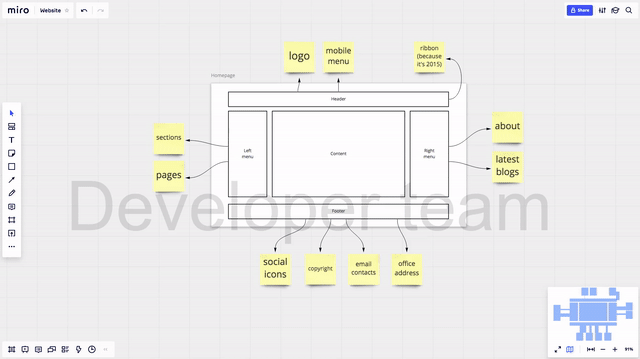

# Estimate
Estimates management plugin for widgets on Miro.com boards.

Created as a submission to https://go.miro.com/platform-contest

The use of plain Vanilla JS is intentional as I wanted to test whether it's
still (or already?) possible to create something useful without all the
shiny modern JS libraries. I guess it is.

# Showcase

Or you can watch [video (with voice-over!)](https://miro-estimate.glitch.me/promo/miro-estimate-showcase.mp4)